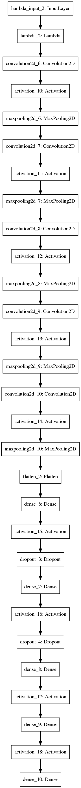
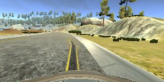
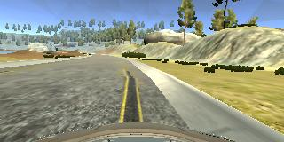

# Behavioral cloning
Teaching Self driving car how to steer in a simulator

## Deriving and designing model

An abstraction of pipeline is created in the model.py
This allowed me to quickly switch between different architectures.

Initially, I tried Nvidia's model:

https://images.nvidia.com/content/tegra/automotive/images/2016/solutions/pdf/end-to-end-dl-using-px.pdf

with my own recorded data from the keyboard simulator, but it did not produce 
smooth angles, which led to many 0 zero data points, which in turn led to
the neural network getting stuck in a local optima and predicing a constant angle.

I tried desperately to avoid this stucking using Dropout and L2 regularization, but 
of course this did not help, because the problem was in the data.

At this point, I also tried VGG16, Comma.ai's model, and my own model based on Comma.ai,
but none of them really worked, again because of the data.

I then switched to Udacity's data, and although most models performed slightly better,
thy were still very far from satisfactory. 

I then generated additional data using my own ideas and blog posts I found online.
The additional images that are getting generated are with augmented brightness or
with added shadow. The data augmentation technique I used is taken from here:
https://chatbotslife.com/using-augmentation-to-mimic-human-driving-496b569760a9#.xneaoqiwj

This improved the behaviour, but was still unsufficient.
I then tried lowering the size of the input image, to speed up the computations, as well
as adding pooling layers in the feature extraction part of the network.

I then recorded data intentionally with mostly images of recovery, about 11000 of them
and finetuned Nvidia's model on them. It made a significant improvement in both validation
accuracy and the overall behavior of the model. After adding dropout, the model was able to
navigate safely through the track.

## Model architecture

The final model takes a 64x64x3 input image, performs normalization on it, and then has
2 convolutional layers with 5x5 convolution with 2x2 subsampling, then 3 convolutional
layers with 3x3 filter size, then fully connected part, in which we have Dropout.

## Training dataset

I used my own recorded recover data, to teach the model how to recover when he does wrong,
as well as Udacity's data. The recovery data consists of different situations when the car
did not position itself in the center, and then comes back.
The model was trained with Adam as optimizer, with default learning rate and mean squared error.
I also recorded a separate validation dataset, which consisted of one full lap on the track. 
Images with augmentated brightness and random shadows were generated  in the training data generator on the fly.

